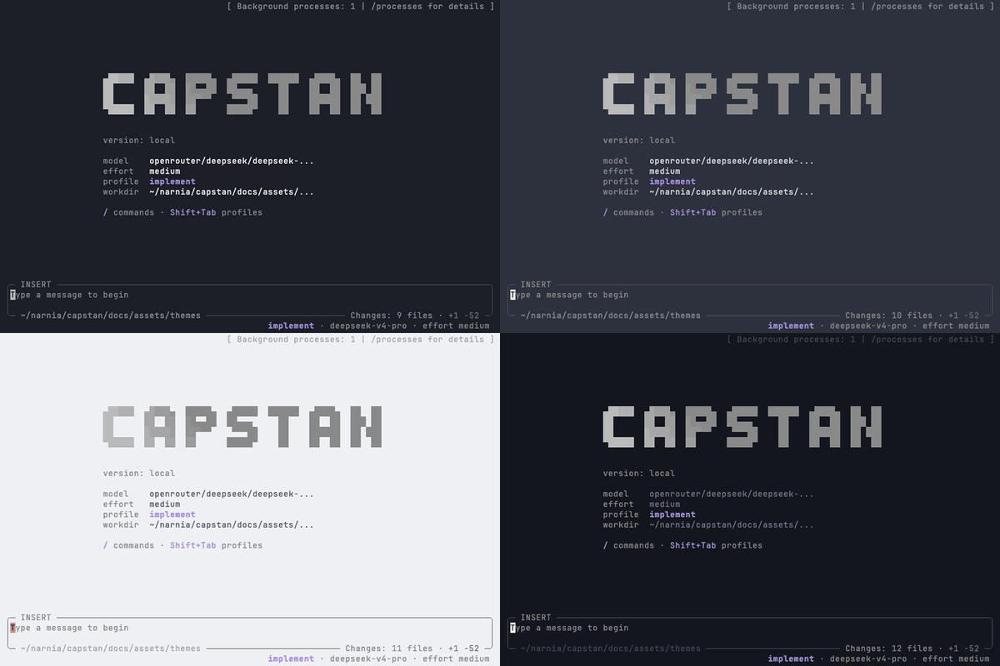

# Capstan

[](https://github.com/theStrangeAdventurer/capstan/actions/workflows/build-binaries.yml)
[](https://github.com/theStrangeAdventurer/capstan/releases/latest)
[](https://github.com/theStrangeAdventurer/capstan/tags)

**A lightweight, extensible terminal coding agent built in C with an embedded Lua runtime.**

*If you find this project interesting, consider giving it a ⭐ — it helps more people discover Capstan.*



Capstan combines a native ncurses interface, headless automation, explicit tool
permissions, profiles, skills, ACP, MCP, and parallel subagents in one compact
executable. It is designed to stay inspectable, fast to start, and easy to adapt
without rebuilding the core.

## Competitive results, dramatically lower local overhead

In the latest Aider Polyglot comparison, Capstan passed **24/24** and OpenCode
passed **23/24** upstream test runs. Capstan used about **4.6× less aggregate
local CPU** and **~20× less peak main-process RSS** (59 MiB vs 1177 MiB), while
completing the aggregate agent wall time **~23% faster** (1582s vs 2048s). Both
agents used DeepSeek V4 Pro with medium reasoning through OpenRouter across the
same 12 tasks, repeated twice.

[See the full run report and per-task breakdown.](benchmarks/historical/polyglot-openrouter-20260828/README.md)
The [published benchmark report](benchmarks/REPORT.md) and reproducible harness
remain available separately. Results are workload-, provider-, model-, and
machine-specific.

## Highlights

- **Native and lightweight.** C hosts the terminal/runtime boundary; embedded
  Lua owns agent policy and extension behavior.
- **Interactive and headless.** Use the ncurses TUI, `capstan run` in scripts or
  CI, or `capstan acp` from an ACP-compatible editor.
- **Controlled autonomy.** Workspace boundaries, sensitive-path checks,
  permission rules, profiles, and `--yolo` remain explicit.
- **Profiles and subagents.** Switch between implementation and read-only
  planning workflows, add your own profiles, and delegate focused tasks
  concurrently with bounded tools and turns.
- **Skills and project instructions.** Reusable Markdown skills and layered
  `AGENTS.md` files teach workflows without hiding policy in the binary.
- **Extensible in Lua.** Plugins can add slash commands, autocomplete, model
  tools, OAuth providers, and lifecycle hooks with TUI hot reload.
- **Open integrations.** Connect MCP servers, local OpenAI-compatible models,
  remote providers, and vision-capable models.
- **Persistent local context.** Workspace sessions, input history, runtime logs,
  and the optional Markdown Wiki stay inspectable on disk.

## Quick Start

### Install a prebuilt binary

The installer requires `curl`, `tar`, and either `sha256sum` or `shasum`, and supports:

| Platform | Architecture |
|---|---|
| macOS | Apple Silicon (`arm64`) |
| Linux | `x86_64` |
| Linux | `arm64` / `aarch64` |

Check the prerequisite and install the latest published release:

```sh
command -v curl
command -v tar
command -v sha256sum || command -v shasum
curl -fsSL https://raw.githubusercontent.com/theStrangeAdventurer/capstan/main/install.sh | sh
export PATH="$HOME/.local/bin:$PATH"
```

The installer downloads the matching GitHub Release archive, verifies its
SHA-256 checksum, and installs `capstan` into `~/.local/bin`. For a different
platform or architecture, use [Build From Source](#build-from-source).

### Choose a provider

DeepSeek is the built-in default:

```sh
export DEEPSEEK_API_KEY=...
capstan
```

OpenRouter:

```sh
export OPENROUTER_API_KEY=...
export CAPSTAN_PROVIDER=openrouter
export CAPSTAN_MODEL=anthropic/claude-sonnet-4
capstan
```

Headless mode uses the same runtime and tools:

```sh
capstan run --prompt "Inspect this repository"
capstan run --profile plan --prompt-file task.md
capstan run --prompt-file task.md --json
```

### Try self-improvement in one minute

Capstan can teach itself durable local behavior by creating user plugins. Enable
the gated capability in `~/.config/capstan/config.lua`:

```lua
return {
  capabilities = {
    self_improvement = true,
  },
}
```

If you already have a config, add `self_improvement = true` to its existing
`capabilities` table instead of replacing the file. Restart Capstan so the
built-in skill is loaded, then paste this prompt:

```text
Create a `/hello` command that replies `Hello from Capstan!` and enable it without restarting.
```

Capstan writes the Lua plugin, hot-reloads it, and keeps it available in future
sessions. Type `/hello` to test it; the expected response is
`Hello from Capstan!`. You can inspect, edit, or delete the generated file at
any time. See [Self Improvement](specs/self-improvement.md) and
[Plugins](specs/plugins.md) for the full extension contract.

### Attach images

In the interactive TUI, copy an image to the system clipboard and press
**Ctrl-V** once to attach it to the current prompt. Capstan shows the attachment
as `[Image N]`; multiple images can be attached, and Backspace removes the most
recent image when the text field is empty.

Clipboard images are converted to PNG, limited to 10 MiB each, and sent as
structured vision input. The selected provider and model must support image
input. Image-only prompts are supported. See
[Multimodal Images](specs/multimodal-images.md) for platform requirements and
tool-provided images.

## Benchmark: Capstan vs OpenCode

The latest Aider Polyglot comparison used DeepSeek V4 Pro, medium reasoning,
OpenRouter, public prompts, upstream tests, and a 240-second timeout for both
agents across 12 tasks, repeated twice.

| Metric | Capstan | OpenCode |
|---|---:|---:|
| Upstream tests passed | **24/24 (100%)** | 23/24 (95.8%) |
| Total agent wall time | **1582.1s** | 2047.9s |
| Median agent wall time | **46.7s** | 55.2s |
| p95 agent wall time | **132.7s** | 237.5s |
| Total local CPU time | **61.6s** | 286.4s |
| Peak main-process RSS | **59.0 MiB** | 1177.3 MiB |

On this workload, Capstan used **78.5% less aggregate local CPU** and about
**~20× less peak main-process RSS**, while completing the aggregate agent wall
time **22.7% faster**. OpenCode's only failure was `python/pov` hitting the
240-second agent timeout in the second run. The harness samples only the primary
agent PID every 50 ms, excluding child compilers, test runners, and tool
processes. Wall time covers agent activity excluding harness bookkeeping.

See the [run report and per-task breakdown](benchmarks/historical/polyglot-openrouter-20260828/README.md),
the [published benchmark report](benchmarks/REPORT.md), and the
[reproducible harness](benchmarks/README.md). Results are workload-, provider-,
model-, and machine-specific.

## Profiles

| Profile | Purpose | Default reasoning | Model tools |
|---|---|---|---|
| `implement` | Focused code changes and verification | `medium` | Normal tools |
| `plan` | Investigation and planning | `high` | Read-only tools |

Controls:

- press **Shift-Tab** to cycle every configured profile in the TUI;
- press **Shift-↑ / Shift-↓** to raise/lower reasoning effort for the active profile;
- run `/implement` or `/plan` for the built-in profiles;
- use `capstan run --profile <name>` in headless mode;
- use `/models` to assign models and reasoning effort globally or per profile.

Built-in profiles are embedded as Lua definitions. Add or override profiles with
trusted Lua files under `~/.config/capstan/profiles/*.lua`; files load in lexical
filename order. For example, create a read-only review profile:

```lua
-- ~/.config/capstan/profiles/review.lua
return {
  name = "review",
  label = "Review",
  order = 40,
  reasoning_effort = "high",
  readonly = true,
  completion_review = false,
  allowed_tools = {
    fetch = true,
    file_read = true,
    logs = true,
    subagents = true,
  },
  prompt = [[
## Active Profile: Review
Review the current changes without modifying files. Focus on correctness,
regressions, security, and missing tests. Report findings first, ordered by
severity, with precise file and line references when possible. If there are no
findings, say so explicitly and mention any remaining validation gaps.
]],
}
```

Select it with Shift-Tab, set `agent.profile = "review"`, or run
`capstan run --profile review --prompt "Review the current changes"`. A file
with an existing `name` patches that profile: omitted fields are inherited,
`prompt_append` adds instructions, and `replace = true` starts from an empty
definition. See [Agent Profiles](specs/agent-profiles.md) for the complete
contract.

Profile tool restrictions are enforced before plugin and permission handling:
tools absent from `allowed_tools` are not sent to the model. Manual slash
commands remain direct user actions.

## Configuration

Capstan works without a config file: set `DEEPSEEK_API_KEY` and run `capstan`.
To keep provider, agent, permission, Wiki, and optional MCP settings in one
place, copy the complete starter config:

```sh
mkdir -p "$HOME/.config/capstan"
curl -fsSL \
  https://raw.githubusercontent.com/theStrangeAdventurer/capstan/main/examples/config.lua \
  -o "$HOME/.config/capstan/config.lua"
${EDITOR:-vi} "$HOME/.config/capstan/config.lua"
```

The example is safe to copy as-is: it reads API keys from environment variables,
keeps MCP disabled, and explicitly denies `.env` file access. Before relying on
its broad workspace permissions, replace `~/code/my-project` with the directory
you actually want Capstan to modify.

For the default DeepSeek setup:

```sh
export DEEPSEEK_API_KEY=...
capstan
```

For OpenRouter, change `provider = "deepseek"` to `provider = "openrouter"` in
`config.lua`, then run:

```sh
export OPENROUTER_API_KEY=...
capstan
```

See the commented [`examples/config.lua`](examples/config.lua) for the complete
copyable configuration and [`specs/config.md`](specs/config.md) for every field
and its behavior. Keep credentials in environment variables; do not put API keys
directly in `config.lua`.

Runtime environment overrides use Capstan-specific names:

| Variable | Purpose |
|---|---|
| `CAPSTAN_PROVIDER` | Active configured provider |
| `CAPSTAN_MODEL` | Model for the active provider |
| `CAPSTAN_CONTEXT_LIMIT` | Explicit context-window size |
| `CAPSTAN_WORKDIR` | Working directory for relative operations |
| `CAPSTAN_WORKSPACE` | Workspace boundary |
| `CAPSTAN_LOG_LEVEL` | `error`, `warn`, `info`, `debug`, or `trace` |

Provider credential variables remain provider-native, such as
`DEEPSEEK_API_KEY` and `OPENROUTER_API_KEY`. CLI flags (`--provider`, `--model`,
`--reasoning-effort`) override normal runtime choices for the current TUI or
headless process.

### Local models with Ollama

Capstan can use any OpenAI-compatible endpoint. This configuration was tested
against a local Ollama server and `gemma4:latest`:

```lua
return {
  provider = "ollama",
  providers = {
    ollama = {
      endpoint = "http://127.0.0.1:11434/v1/chat/completions",
      models_endpoint = "http://127.0.0.1:11434/v1/models",
      model = "gemma4:latest",
      context_limit = 32768,
    },
  },
}
```

Start Ollama, verify the model, then run Capstan:

```sh
ollama list
CAPSTAN_PROVIDER=ollama CAPSTAN_MODEL=gemma4:latest capstan
```

Local model quality and tool-calling support depend on the chosen model.

### Project instructions

Capstan loads instructions in this order:

1. `~/.config/capstan/AGENTS.md`;
2. `~/.agents/AGENTS.md` only when the Capstan-specific file is absent;
3. `<workspace>/AGENTS.md`.

User instructions are followed by project instructions, so repository policy
can add project-specific constraints. Instruction files are loaded once at
startup. `capstan run --benchmark` excludes them for isolated evaluations.

### Permissions and `--yolo`

Durable allow/deny rules belong in `config.lua`:

```lua
return {
  permissions = {
    {tool = "file_read", pattern = "~/code/project/*", allow = true},
    {tool = "file_write", pattern = "~/code/project/*", allow = true},
    {tool = "file_read", pattern = "~/code/project/.env*", allow = false},
  },
}
```

Later matching rules win. Explicit denies also win over `--yolo`.

```sh
capstan --yolo
capstan run --yolo --prompt "Run the test suite and fix the failure"
```

`--yolo` is process-local and should only be used in a trusted workspace. See
[Permissions](specs/permissions.md) and the full [Config](specs/config.md).

## Built-In Tools

Model-initiated tools pass through profile availability and permissions:

- `file_read` — read files or list directories, including batched reads;
- `file_write` — create or overwrite a file;
- `file_edit` — replace an exact fragment safely;
- `shell` — execute a bounded non-interactive subprocess;
- `fetch` — fetch an HTTP or HTTPS URL;
- `logs` — inspect recent Capstan runtime logs;
- `subagents` — run focused internal agents concurrently;
- Wiki tools — read or ingest portable Markdown context;
- MCP tools — dynamically exposed by configured MCP servers.

Type `/` and press Tab to browse user-facing commands such as `/file`, `/edit`,
`/shell`, `/models`, `/sessions`, `/skills`, `/wiki`, `/mcp`, `/info`, and
`/logs`.

## Extensibility

User plugins are trusted Lua files under:

```text
~/.config/capstan/plugins/*.lua
```

They are hot-reloaded in the TUI. A plugin may be a slash command, model tool,
autocomplete source, OAuth provider, hook, or any combination of them.

### Slash command and model tool

```lua
---@type CapstanPlugin
local plugin = {
  id = "project_status",
  name = "Project Status",
  command = "/status",
  tool = {
    name = "project_status",
    description = "Read the current project status.",
    parameters = {type = "object", properties = {}},
    permission = "project_status",
  },
}

function plugin.handler(ctx)
  return ctx:replace("Project is ready.")
end

return plugin
```

Add `plugin.autocomplete` when command arguments have discoverable values. Add
`plugin.history = false` for control commands that should not enter model
context or trigger an agent request.

### Completion notification hook (macOS)

```lua
local plugin = {
  id = "turn_notification",
  hooks_scope = "orchestrator",
  hooks = {},
}

plugin.hooks.after_agent_turn = function(ctx)
  tools.shell([[osascript -e 'display notification "Agent turn finished" with title "Capstan"']], 5)
  return ctx
end

return plugin
```

`after_agent_turn` runs after tool continuations finish and control returns to
the user. Keep notification hooks orchestrator-only so subagents do not produce
extra alerts.

### OAuth provider plugin

OAuth integration remains provider-specific but uses Capstan's secure credential
store and standard hooks:

```lua
local auth = require("agent.auth")
local plugin = {id = "example_oauth"}

plugin.auth = {
  provider = "example",
  authorize = function(method, ctx)
    -- Complete the provider flow and return the resulting credential.
    return {type = "oauth", access = "...", refresh = "...", expires = 0}
  end,
}

plugin.hooks = {
  before_request = function(ctx)
    if ctx.provider_name ~= "example" then return ctx end
    local credential = auth.get("example")
    if not credential then error("Run /connect example first") end
    ctx.headers.Authorization = "Bearer " .. credential.access
    return ctx
  end,
}

return plugin
```

Use `/connect`, `/auth`, and `/logout` with OAuth-capable plugins. Never commit
real credentials. See [Plugins](specs/plugins.md), [Hooks](specs/hooks.md),
[OAuth](specs/oauth-auth.md), and the gated `self-improvement` skill.

### Skills, MCP, and ACP

- Project skills: `.agents/skills/<name>/SKILL.md`
- User skills: `~/.agents/skills/<name>/SKILL.md` or
  `~/.config/capstan/skills/<name>/SKILL.md`
- MCP: local stdio and remote Streamable HTTP servers
- ACP: `capstan acp [--yolo]` for ACP-compatible editors and orchestrators

Only skill metadata is added eagerly; full Markdown instructions are read when a
task matches the skill. See [Skills](specs/skills.md), [MCP](specs/mcp-client.md),
and [ACP](specs/acp.md).

## Sessions and Context

The TUI stores sessions per workspace:

- `/new` creates a session;
- `/sessions` opens the searchable session list;
- `/compact` creates an operational handoff for long conversations;
- queued input waits in a bounded FIFO while the agent is active;
- `/wiki` manages portable Markdown context.

Use `--session-id ID` in either mode to select a workspace-scoped conversation.
Capstan resumes it when it exists, or creates it with that stable key/title when
it does not. Invalid or corrupted sessions fail rather than being overwritten.
Headless runs without the flag remain ephemeral.

## Build From Source

Use this path for development or a platform without a prebuilt release.

### macOS

```sh
xcode-select --install
./build.sh
```

### Debian / Ubuntu

```sh
sudo apt install build-essential libcurl4-openssl-dev ncurses-bin
./build.sh
```

### Fedora

```sh
sudo dnf install gcc make libcurl-devel ncurses
./build.sh
```

The binary is written to `build/capstan`. ncurses and Lua are built from
vendored source and linked statically; libcurl is the only system-linked runtime
library beyond normal platform libraries.

Development checks:

```sh
make test
make test-http-lua
make test-build
```

## Observability

Capstan exports structured logs and traces over OpenTelemetry OTLP/HTTP:

```text
Capstan → OpenTelemetry Collector → Tempo (traces) + Loki (logs) → Grafana
                                 → files (optional OTLP JSON exporter)
```

Start an OTLP-compatible Collector or a local
[Grafana LGTM stack](https://github.com/grafana/docker-otel-lgtm), then merge this
section into your existing `~/.config/capstan/config.lua` and restart Capstan:

```lua
observability = {
  enabled = true,
  endpoint = "http://127.0.0.1:4318",
  include_session_name = true,
}
```

The endpoint is the Collector's OTLP/HTTP receiver, not Grafana's web address.
Session names are opt-in because they may contain private information. New
runs capture the session context; old traces are not updated retroactively.

In Grafana, import the dashboard below and select a session to find its runs.
Open a Trace ID for the timeline of model requests, tools, and child agents,
then follow the linked logs for operation context and outcomes. These are
structured diagnostic events, not a transcript of prompts and responses.

Examples and setup guides:

- [Local Grafana walkthrough](examples/observability/grafana-capstan.md)
  (Russian): Docker/OrbStack setup, components, session search, and timelines.
- [Grafana integration](examples/observability/grafana.md): data sources,
  queries, and trace-to-log links.
- [Session diagnostics dashboard](examples/observability/capstan-dashboard.json):
  import via **Dashboards → New → Import**; requires Tempo and Loki.
- [OTLP JSON file exporter example](examples/observability/otel-collector-file.yaml)
  and [run instructions](examples/observability/grafana-capstan.md#10-пример-сохранить-otlp-в-файл-без-grafana):
  Collector Contrib writes logs and traces to files without Grafana or
  `--trace-file`; this example uses receiver port **14318**.
- [Observability specification](specs/observability.md): configuration,
  exported fields, privacy, and coverage limits.

## Debugging

Use `/logs` in the TUI or let the model call the `logs` tool. Process logs live
at:

```text
$XDG_STATE_HOME/capstan/logs/YYYY-MM-DD.log
~/.local/state/capstan/logs/YYYY-MM-DD.log          # fallback
```

Session-scoped logs live under `logs/sessions/<session-id>/`. Increase detail
for one run with:

```sh
CAPSTAN_LOG_LEVEL=debug capstan
CAPSTAN_LOG_LEVEL=trace capstan   # includes redacted raw stream payloads
```

Trace logs can contain model output and should still be treated as sensitive.
See [Runtime Logs](specs/runtime-logs.md).

## Contributing

1. Open an issue for behavior or architecture changes that need discussion.
2. Keep changes focused and follow [`AGENTS.md`](AGENTS.md).
3. Add or update tests and a focused spec for user-visible behavior.
4. Run:

   ```sh
   make test
   make test-http-lua
   make test-build
   ```

5. Submit a pull request with the motivation, implementation notes, and checks
   run.

Capstan uses C99 with `-Wall -Wextra -Werror`, an embedded Lua runtime, vendored
ncurses/Lua, and no dependency additions for ad-hoc validation.

## License

Apache License 2.0. See [LICENSE](LICENSE), [NOTICE](NOTICE), and
[THIRD_PARTY_NOTICES](THIRD_PARTY_NOTICES).
