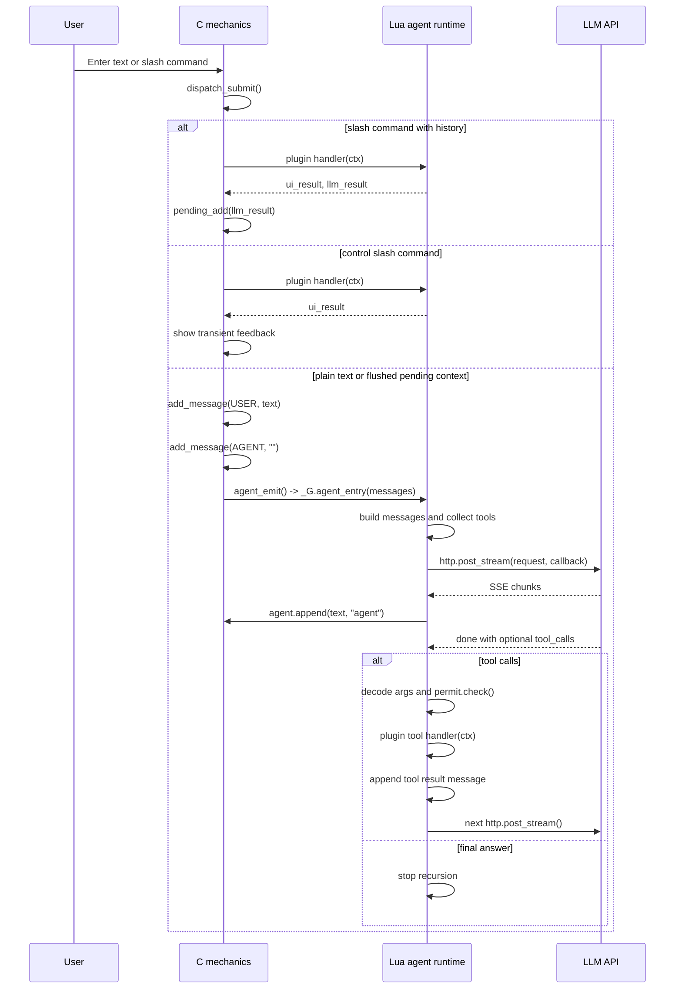

# Agent Loop

This spec defines the agent cycle contract: how user input becomes LLM requests,
how model tool calls are executed, and where responsibility is split between C
and Lua.

## Layer Ownership

Capstan intentionally keeps mechanics in C and agent policy in Lua.

C owns runtime mechanics:

- terminal lifecycle, ncurses rendering, input, popups, and message storage;
- command dispatch and pending slash-command results;
- libcurl multi integration exposed as Lua `http` helpers;
- embedded asset loading and Lua module preload;
- persisted permission rule loading/saving and permit popup rendering;
- filesystem-heavy features such as recursive finder scans.

Lua owns agent policy:

- provider config merge, model selection, request body construction, and model
  listing;
- OpenAI-compatible SSE semantics and provider-specific chunk parsing;
- model tool schema collection, tool-call orchestration, and tool result
  messages;
- runtime logging decisions and approximate token accounting;
- plugin behavior and future hook filters around the agent pipeline.

The bridge globals are deliberately small: `agent`, `http`, `permit`, `popup`,
and `capstan`. C should not grow provider-specific branches unless the behavior
is pure mechanics. Lua should not take over terminal state, message ownership,
curl handle lifecycle, or persisted permission storage.

## Agent Runtime Modules

| Module | Responsibility |
|--------|----------------|
| `agent/runtime.lua` | Top-level `_G.agent_entry`, request loop, recursive continuation. |
| `agent/provider_config.lua` | Built-in providers plus `capstan.config` and environment overrides. |
| `agent/models.lua` | `capstan.models`, provider `/models` fetch, model normalization, context limit lookup. |
| `agent/state.lua` | Small persisted runtime preferences such as selected models. |
| `agent/stream.lua` | SSE buffering, chunk parsing, text/reasoning/tool-call accumulation. |
| `agent/tools.lua` | Tool schema collection, permission bridge, plugin tool execution, tool result messages. |
| `agent/tokens.lua` | Approximate token accounting for UI usage display. |
| `agent/logging.lua` | Compact runtime logging helpers. |
| `agent/hooks.lua` | Pipeline hook registry and config/plugin hook installation. |

## Sequence



## Message Flow Contract

After ordinary text submission, C always creates the agent placeholder before
calling Lua. While that top-level run remains active, later ordinary
submissions are held in the bounded FIFO described in
[Queued input](queued-input.md); they do not create another placeholder or call
Lua concurrently. When the run's `on_done` callback clears the active state,
the main loop adds the queued items as separate consecutive user messages,
creates one placeholder, and dispatches one batch run.

```text
add_message(text, MSG_USER)
add_message("", MSG_AGENT)
agent_emit(L)
```

`agent_emit()` filters empty messages before passing history to Lua, so the empty
agent placeholder is not sent to the model. The placeholder still exists in C
message storage, which lets `agent.append(chunk, "agent")` fill the visible
assistant response during streaming. The TUI adapter reports top-level run
completion through `agent.finish_run()`; queued dispatch happens later from the
main event loop to avoid re-entering Lua from an HTTP callback.

Slash commands are direct user intent. By default a command handler returns UI
text and LLM text; the LLM text is stored as pending context and flushed into
the next user message. Commands may set `plugin.history = false` to become
control commands: their UI result is shown to the user, but nothing is added to
pending context and the agent is not emitted. Manual slash commands do not pass
through model-tool permission checks.

## Lua Agent Cycle

`agent_emit()` calls `_G.agent_entry(messages)`, installed by
`agent/runtime.lua` during startup. `_G.agent_entry` is now the TUI adapter over
the reusable `capstan.agent.run(opts, callbacks)` runtime entry point used by
both TUI and headless CLI mode.

The runtime:

1. Resolves the active provider and status-line model.
2. Builds `messages` from `system_prompt` plus C-provided history.
3. Collects model tools from loaded plugins via `agent/tools.lua`.
4. Builds an OpenAI-compatible request body.
5. Sends `http.post_stream()` with a Lua stream callback.
6. Appends text chunks to the current agent placeholder.
7. If the final stream result contains tool calls, executes tools and recurses
   with appended `{role="tool"}` messages.
8. After an unvalidated multi-file implementation phase in the `implement`
   profile, starts one bounded completion-review continuation before exposing
   the final answer. Successful validation suppresses the redundant pass. The
   suppression is cleared by any later workspace write. The review re-checks
   the original request, source changes, and available evidence; it may fix a
   concrete issue, but cannot trigger another review.

Headless `capstan run` builds the same message shape and calls
`capstan.agent.run` directly, with callbacks that buffer final stdout instead of
appending to the TUI message list.

The embedded system prompt treats coding runs as implementation-first,
contract-first work. Before editing, the agent derives a private acceptance
checklist from explicit requirements, project instructions, and affected
interfaces. The checklist includes preservation and negative constraints,
exact semantics, user-visible behavior, and meaningful API success/error
values. The agent inspects neighboring patterns, declared dependencies, and
actual project test commands before introducing a library or validation
harness, then makes the smallest correct edit within scope.

Validation should use the highest-signal available check;
overlapping searches or generated-output inspections must not be used to
re-prove a property already covered by a successful check. Additional checks
must cover a distinct requirement, follow a new edit, or investigate a concrete
failure. After a successful primary build or test, at most one static generated-
output inspection may cover remaining facts; an inconclusive inspection must
lead to source inspection, direct behavioral validation, or an explicit
unverified report rather than command variants against the same artifact.
Build, typecheck, and lint results count only as evidence for the properties
they directly cover, not as proof of runtime behavior, accessibility, exact
configuration semantics, or negative constraints. Dependencies and manifests
must not be changed solely to construct an ad-hoc validation harness.

For user-visible progress, the model gives one short intent line before a
non-trivial tool batch or phase change. Text accompanying tool calls is shown
immediately, including after workspace mutations; only a no-tool draft that is
about to enter completion review remains deferred. Tool status blocks also use
deterministic phase labels such as `Reading`, `Editing`, and `Validating` when
the model emits no annotation. Every visible tool block starts after one blank
line so it remains visually separate from the preceding agent commentary.

A successful provider response with neither text nor tool calls is not a valid
terminal result. The runtime adds one synthetic continuation asking the model
to either take the next necessary action or finalize concisely. A second empty
terminal response fails the run visibly instead of leaving an empty assistant
placeholder. The retry policy is owned by the common agent loop and therefore
applies consistently across providers and TUI/headless entry points.

The base prompt favors an operational loop: read the relevant implementation
and nearby tests, implement a visibly missing requirement before broad
validation, run the narrowest meaningful check, and stop after it succeeds.
Independent calls belong in one model response and use batch-capable tools when
available. Benchmark mode keeps this embedded policy but excludes machine- and
project-specific prompt additions so evals do not inherit unrelated skills,
`AGENTS.md`, prompt overrides, or config/plugin hooks.

Reasoning effort is an explicit run/config policy. `agent.reasoning_effort` and
`capstan run --reasoning-effort` accept the common provider vocabulary
`none|minimal|low|medium|high|xhigh|max`. This is a model/request control, not
an agent workflow mode. The runtime uses the provider's configured wire field:
OpenRouter keeps `reasoning.effort`, while direct DeepSeek uses top-level
`reasoning_effort`. It does not add extra system prompt text for the setting.
Provider configs can also define `reasoning`, `reasoning_effort_field`,
`reasoning_max_tokens`, and `reasoning_exclude` for gateway-specific controls.

Reasoning continuity is enabled by default for tool continuations. The stream
adapter preserves `reasoning_details` in provider order and attaches the whole
sequence to the assistant tool-call message; plaintext `reasoning` is used only
when structured details are absent. Direct DeepSeek chat requests adapt that
fallback to `reasoning_content`; Responses-style providers own their native
reasoning-item continuation in their provider adapter. These fields remain
model-only history and are not rendered as assistant text.
`agent.preserve_reasoning = false` or `--no-preserve-reasoning` disables the
behavior.

Responses adapters running with `store=false` must request encrypted reasoning
content, preserve completed reasoning items as structured `reasoning_details`,
and replay those items before the associated function calls. Provider terminal
events such as `response.failed`, `response.incomplete`, and `error` are hard
stream failures, not empty model responses. An adapter reports them as
`provider_error` chunks so the agent loop surfaces the provider message without
running the empty-terminal finalization retry.

For non-2xx streaming responses, the transport error body is never copied
wholesale into model-visible history. The stream layer extracts a structured
error code/message, or a bounded plain-text fallback, and applies normal
redaction and truncation. Streaming response headers are retained long enough
to surface safe request identifiers such as `x-request-id` or `cf-ray`. If the
provider sends an empty error body, the user-facing error states that fact and
includes the available request identifier instead of displaying only
`HTTP 400`.

Before JSON encoding, the runtime replaces malformed UTF-8 bytes in all request
string values with U+FFFD and logs the replacement count. This is a final
provider-boundary safeguard for old persisted sessions and plugin/tool output;
invalid local bytes must not turn into an opaque provider validation error.

Profiles are workflow policy. `agent.profile`, `capstan run --profile`, and the
TUI slash commands `/fast`, `/implement`, and `/plan` select named profiles.
Profiles can append system prompt guidance, choose a default reasoning effort,
and filter model tools. `plan` is read-only for model-initiated tools: it keeps
inspection tools such as `file_read`, `fetch`, and `logs`, and removes write,
shell, and subagent tools.

The loop is recursive through a continuation function: every tool round produces
a new HTTP request with the expanded message history. Esc cancellation can stop
active curl streams, but it cannot interrupt synchronous Lua work inside tool
processing until control returns to the main loop.

Tool results sent back to the model are bounded by the canonical tool layer.
The defaults are 50 KiB and 2,000 lines per result, matching the practical
limits used by the reference OpenCode workflow. A truncated result contains its
original byte count and tells the model to use a narrower query or paged read.
The limits apply across providers and can be changed with top-level
`tool_output.max_bytes` and `tool_output.max_lines`.

Agent runs also carry an automatic guard to catch runaway loops before the next
tool executes. By default the guard stops after 80 turns, 900 seconds, 80 total
tool calls, or 3 consecutive identical non-shell tool calls. The shell-specific
repeated-command guard is disabled by default because real coding workflows
often repeat commands such as `pwd`, `git status`, or `make test`; it can be
enabled with `agent.max_same_shell_command`. These values can be overridden with
the `agent.max_*` fields in `config.lua`. When the guard trips, the runtime
appends a visible `[stopped: ...]` marker, logs `tool_guard`, calls the run error
callback, and finishes the run with `ok = false`. The guard runs before
permission checks and before tool execution.

Each streaming model request is separately bounded to 300 seconds by default.
If a transient transport or server failure occurs before producing text, the
runtime retries it once; a stream that has already produced visible text is
never retried automatically. This transport policy is independent of benchmark
mode and prevents provider heartbeats or stalled streams from bypassing the
agent-loop guard indefinitely.

The overall `max_duration_sec` guard counts active agent time. It pauses only
while the blocking permission prompt is waiting for a user decision and resumes
immediately after allow or deny. Provider waits, tool execution, ordinary
popups, and all other agent work continue to count toward the limit. The guard
is owned by `agent/runtime.lua`; the tool permission path only signals pause and
resume around `permit.prompt`, including when the prompt raises an error.

When the paths of several independent files are already known, the base system
prompt directs the model to batch them through `file_read.paths`. Sequential
reads remain appropriate when one result determines which file to inspect next.

Generated-output inspection has a separate soft guard. By default the first
static shell inspection of `dist/`, `build/`, `out/`, or `coverage/` is allowed;
later inspection variants are skipped and returned to the model as guidance to
inspect source, run a behavioral check, or report the requirement as unverified.
This does not fail the run. `agent.max_generated_output_checks` configures the
limit, and zero disables it.

Synchronous tool work runs on the UI thread. Any blocking C helper used by a
tool must periodically yield through the TUI pump so the screen can repaint and
safe navigation keys can be handled. It must not recursively call `http_poll()`
from inside stream callback/tool execution paths.

## Tool Contract

Plugins may expose a model tool by returning `plugin.tool`:

```lua
plugin.tool = {
  name = "fetch",
  description = "Fetch an HTTP or HTTPS URL and return the response body.",
  parameters = { type = "object", properties = { url = { type = "string" } } },
  permission = "fetch",
}
```

`agent/tools.lua` converts these tables to OpenAI function-tool schemas. When
the model calls a permissioned tool, Lua decodes JSON arguments, derives a
permission target, checks `permit`, calls the matching plugin handler with
`ctx.tool_args`, and adds a tool result message back into the recursive
conversation.

Plugin model tools may return an expected failure through `ctx:error(ui, llm?)`.
The runtime sends the supplied model result as the tool message but records and
renders the call as failed. Existing `ctx:replace(ui, llm?)` handlers remain
successful by default.

Tool handler errors are contained inside the Lua runtime. A failing handler must
produce a `{role="tool"}` diagnostic result with plugin id, source, arguments,
and traceback; log the failure; and mark the visible tool row with a compact
error reason instead of throwing through the stream callback.

Before decoding tool arguments, the runtime strips known provider-leaked tool
markup such as Minimax/OpenRouter sentinel fragments from the raw JSON argument
string and from decoded string values. This normalization is intentionally scoped
to tool-call arguments so ordinary assistant text is not rewritten.

If a Minimax-family model emits a tool call as ordinary assistant text instead
of structured `tool_calls`, the runtime treats it as a provider/model protocol
error. It does not try to infer or execute the textual call. Minimax text chunks
are buffered until stream completion so leaked pseudo-tool payloads such as
`old_text`/`new_text` file edits are not appended to the visible conversation
before the final protocol decision. On violation, the runtime appends a compact
provider error, logs `minimax_text_tool_call_protocol_error`, and finishes the
run with `ok = false`.

Long-running built-in tools should log start/finish timing in the runtime log.
The shell tool is the reference case: it waits for subprocess output with a
short poll interval, pumps the TUI between waits, and uses non-blocking
`waitpid()` so post-permission execution does not freeze the interface.

Permission policy is shared: Lua chooses the tool name and target for the check;
C owns rule storage, matching, saving, and the prompt UI.

The built-in `subagents` tool is not a plugin file. It is collected by
`agent/tools.lua` unless `capabilities.subagents = false`. It starts multiple
internal `capstan.agent.run` executions, hides `subagents` from nested tool
lists, and returns one structured JSON tool result to the orchestrator.
`subagents` itself does not use a permission target; its availability and scale
are controlled by `capabilities.subagents` and the `subagents.max_*` limits.
The orchestrator can pass shared `instructions` into a subagent call; the
runtime prepends those instructions to every child prompt. This is intended for
any delegated workflow where the parent has already selected the policy or tool
family: the parent passes concrete instructions down and narrows each child
`tools` list instead of letting children inherit every available tool.

## Extension Points

The primary extension model is Lua plugins:

- slash commands through `plugin.command` and `plugin.handler(ctx)`;
- autocomplete through `plugin.autocomplete`;
- model tools through `plugin.tool`.

User plugins are live files under `~/.config/capstan/plugins/*.lua`; the running
process polls this directory and hot-reloads new, changed, and deleted plugin
files.

Future hook support must extend the pipeline without replacing the whole agent
loop. The intended hook points are message preparation, tool list preparation,
request construction, stream chunks, tool-call preparation, and tool results.
Full `_G.agent_entry` replacement is not the default extension mechanism.

Hooks are agent policy and belong in Lua. Per-stream-chunk hooks are hot-path and
must be opt-in with a cheap no-hook fast path.

## Performance Constraints

- SSE parsing stays in Lua because provider semantics are policy, not mechanics.
- Raw SSE logging remains opt-in via `LOG_LEVEL=trace` because stream payloads
  can be large and sensitive.
- Per-chunk work must stay bounded. Token accounting should avoid rescanning the
  full accumulated answer on every chunk.
- Hook dispatch must skip allocation-heavy work when no hooks are registered for
  a stage.
- Recursive tool continuation is acceptable for the current agent loop, but long
  synchronous plugin work still blocks UI cancellation until it returns.

## Test Notes

- C-only behavior such as dispatch decisions, popup logic, finder, and permission
  matching belongs in `make test`.
- Lua runtime behavior that touches providers, tools, hooks, or HTTP helpers
  belongs in `make test-http-lua` with mocked Lua globals where possible.
- Embedded runtime loading is verified by `make test-build` because it exercises
  generated assets and `package.preload`.
